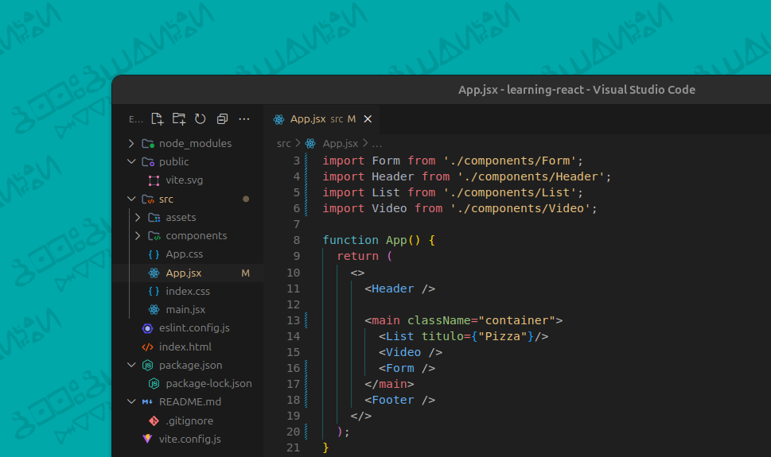

# AllTheme

**AllTheme** é um pacote de temas para o Visual Studio Code desenvolvido por [AllMaciente](https://github.com/AllMaciente). Inclui temas escuros e ícones personalizados para um ambiente de codificação mais agradável.

## Captura de Tela


  
## Instalação

Para instalar o AllTheme, siga estes passos:

1. Abra o Visual Studio Code.
2. Vá para a aba de Extensões (`Ctrl+Shift+X` ou `Cmd+Shift+X` no macOS).
3. Pesquise por "AllTheme".
4. Clique em "Instalar".

Ou você pode instalar o tema diretamente do terminal:

```bash
code --install-extension AllMaciente.vscode-all-theme
```

## Uso

Para ativar o tema, siga estes passos:

1. Abra o Visual Studio Code.
2. Vá para `Configurações` (`Ctrl+,` ou `Cmd+,` no macOS).
3. Pesquise por `Tema de Cores`.
4. Selecione "AllTheme" na lista de temas disponíveis.

Para ativar o ícone do tema:

1. Vá para `Configurações`.
2. Pesquise por `Tema de Ícones`.
3. Selecione "AllTheme" na lista de temas de ícones disponíveis.

## Personalização

Se você deseja personalizar o tema, você pode ajustar as configurações diretamente no arquivo `settings.json` do VSCode. Veja alguns exemplos de personalização:

```json
{
    "workbench.colorTheme": "AllTheme",
    "workbench.iconTheme": "vscode-allicon-theme",
    "editor.tokenColorCustomizations": {
        "textMateRules": [
            {
                "scope": "keyword",
                "settings": {
                    "foreground": "#FF0000"
                }
            }
        ]
    }
}
```

## Contribuindo

Se você gostaria de contribuir para o desenvolvimento deste tema, siga estas etapas:

1. Faça um fork do repositório [AllTheme no GitHub](https://github.com/AllMaciente/AllTheme.git).
2. Crie uma branch para suas alterações (`git checkout -b feature/nova-feature`).
3. Faça suas alterações e commit (`git commit -am 'Adiciona nova feature'`).
4. Faça um push para a branch (`git push origin feature/nova-feature`).
5. Crie um Pull Request.

